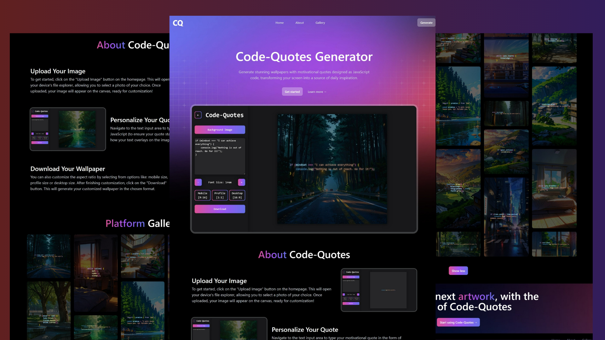

# Code-Quotes Generator 💻✨

A web app that generates random code-quote wallpapers for mobile devices. Users can upload their own images, overlay inspirational coding quotes, and download them as wallpapers. Perfect for devs looking to stay motivated with their daily coding grind!

This project showcases the power of JavaScript and provides a unique way for developers to get inspired by famous code quotes.

## Live Preview 🌍

🔗 [Live Demo](https://code-quotes.vercel.app/)

## Features ✅

- Upload custom images and overlay quotes on them
- Download the generated image as a wallpaper
- User-friendly interface with live preview
- Dynamic quote selection using JavaScript

## Mockup 📸

## What I Learned 📚

1️⃣ **React & State Management:**

- Used React hooks (`useState`, `useEffect`) for managing state and side effects.
- Implemented efficient rendering and dynamic updates for the quote and image preview.

2️⃣ **Vite & React App Setup:**

- Set up the project with Vite for fast development and optimized builds.

3️⃣ **Tailwind CSS:**

- Styled the application using Tailwind CSS for a modern and responsive design.
- Applied utility-first classes to quickly prototype and adjust styles.

4️⃣ **Image Manipulation:**

- Implemented HTML5 Canvas for overlaying text on uploaded images.
- Applied custom styling to ensure text readability on various backgrounds.

5️⃣ **DOM Manipulation:**

- Used JavaScript to dynamically update the quote and image preview in real-time.

6️⃣ **File Handling:**

- Implemented the ability for users to upload and download images with quotes using FileReader and download attributes.

7️⃣ **Version Control & Deployment:**

- Utilized Git & GitHub for version control.
- Deployed the project on Vercel for fast and reliable hosting.

## Technologies Used 🛠️

 - 🌐 HTML5 Canvas API
 - 🎨 Tailwind CSS
 - ⚛️ React
 - ⚡ Vite
 - 🚀 Vercel

## Conclusion 🎉

Developed by Beniamin Hekimian.

Stay motivated with code quotes! ✨
